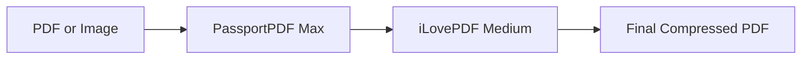

# Two-Stage Compression Pipeline

## Overview

Add a powerful two-stage compression pipeline that first compresses with PassportPDF (maximum), then further compresses with iLovePDF for even smaller files. Remove the Compare Services tab to simplify the interface.

---

## How It Works

### Compression Pipeline

1. **Stage 1: PassportPDF Maximum** - MRC hyper-compression, aggressive settings
2. **Stage 2: iLovePDF Medium** - Further reduces the already-compressed file

This two-stage approach combines the strengths of both engines for maximum compression.

---

### Smart Compress
- PDFs: PassportPDF max → iLovePDF medium → download
- Images: Scan/enhance → Convert to PDF → PassportPDF max → iLovePDF medium → download
- Progress indicator will show both compression stages

---

## User Experience

- Drop files as usual (PDFs or images)
- See "Compressing with PassportPDF..." then "Compressing with iLovePDF..."
- Get the smallest possible file automatically
- No need to choose between services - you get the best of both
